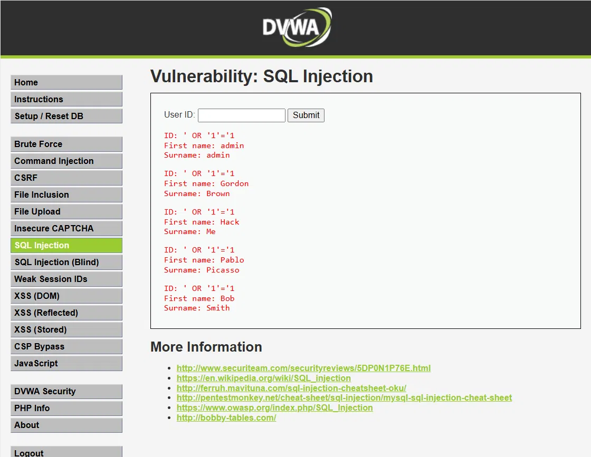

# 02 — Inyección SQL

## 1. Evidencia del ataque

**Módulo DVWA:** SQL Injection  
**Nivel de seguridad:** Low  
**Payload:** `' OR '1'='1`



> **Resultado:** La consulta retorna todos los registros de usuarios de la base de datos,
> incluyendo IDs, nombres y hashes de contraseñas.

---

## 2. ¿Por qué funciona?

La aplicación construye la consulta SQL concatenando el input del usuario directamente,
sin sanitización ni consultas parametrizadas:

```sql
-- Consulta vulnerable
SELECT * FROM usuarios WHERE id = '$input';

-- Consulta resultante con el payload
SELECT * FROM usuarios WHERE id = '' OR '1'='1';
```

La condición `'1'='1'` siempre es verdadera, por lo que la cláusula WHERE no filtra nada
y retorna toda la tabla. En AguasClaras esto expone la totalidad de la base de datos de
clientes: RUT, direcciones, datos de pago y consumo domiciliario.

---

## 3. Puntaje CVSS v3.1

**Vector:** `CVSS:3.1/AV:N/AC:L/PR:N/UI:N/S:U/C:H/I:H/A:H`  
**Puntaje base:** **9.8 — CRÍTICO**

| Métrica | Valor | Justificación |
|---|---|---|
| Vector de ataque | Red (N) | Explotable remotamente vía internet |
| Complejidad | Baja (L) | Sin condiciones especiales |
| Privilegios requeridos | Ninguno (N) | No requiere autenticación |
| Interacción de usuario | Ninguna (N) | El atacante actúa solo |
| Confidencialidad | Alta (H) | Exposición total de BD de clientes |
| Integridad | Alta (H) | Posible modificación/eliminación de datos |
| Disponibilidad | Alta (H) | DROP TABLE puede interrumpir el servicio |

---

## 4. Política de prevención (3.1.4)

AguasClaras debe implementar una política de desarrollo seguro que prohíba la
concatenación directa de inputs en consultas SQL. Todo acceso a BD debe realizarse
mediante **prepared statements** o un ORM con escape automático. Esta política debe
verificarse con revisión de código antes de cada release.

---

## 5. Control de mitigación (3.1.5)

| Control | Descripción | Prioridad |
|---|---|---|
| Prepared statements | Reemplazar todas las queries dinámicas por consultas parametrizadas | Inmediata |
| WAF | Web Application Firewall con reglas OWASP ModSecurity anti-SQLi | Alta |
| Mínimo privilegio en BD | El usuario de BD del portal solo puede hacer SELECT en tablas necesarias | Alta |
| Validación de input | Whitelist de caracteres permitidos en campos de búsqueda | Media |
