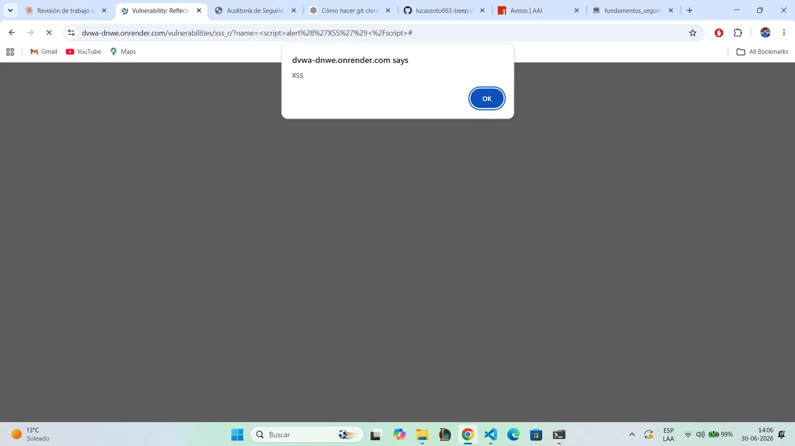

# 03 — XSS Reflejado

## 1. Evidencia del ataque

**Módulo DVWA:** XSS (Reflected)  
**Nivel de seguridad:** Low  
**Payload:** ``

> **Resultado:** El navegador ejecuta el script y muestra el alert, demostrando que
> código arbitrario puede ejecutarse en el contexto de sesión del cliente.

---

## 2. ¿Por qué funciona?

El servidor refleja el input del usuario directamente en la respuesta HTML sin aplicar
codificación de entidades. El navegador interpreta el contenido como JavaScript válido
y lo ejecuta en el contexto de la sesión activa del usuario.

En AguasClaras, un atacante puede distribuir un enlace malicioso que al ser abierto por
un cliente autenticado ejecute código para:
- Robar la cookie de sesión y suplantar al usuario
- Redirigir a un sitio de phishing con apariencia de AguasClaras
- Capturar credenciales de pago en tiempo real

---

## 3. Puntaje CVSS v3.1

**Vector:** `CVSS:3.1/AV:N/AC:L/PR:N/UI:R/S:C/C:H/I:H/A:N`  
**Puntaje base:** **8.8 — ALTO**

| Métrica | Valor | Justificación |
|---|---|---|
| Vector de ataque | Red (N) | El payload viaja en la URL o parámetro web |
| Complejidad | Baja (L) | Solo requiere que la víctima haga clic |
| Privilegios requeridos | Ninguno (N) | Sin autenticación previa |
| Interacción de usuario | Requerida (R) | La víctima debe acceder al enlace malicioso |
| Confidencialidad | Alta (H) | Robo de cookies / credenciales |
| Integridad | Alta (H) | Modificación de la página vista por la víctima |
| Disponibilidad | Ninguna (N) | No afecta directamente la disponibilidad |

---

## 4. Política de prevención (3.1.4)

AguasClaras debe exigir la codificación de toda salida HTML antes de renderizarla.
Se debe implementar la cabecera **Content-Security-Policy (CSP)** en todos los endpoints
del portal, restringiendo la ejecución de scripts inline y fuentes no autorizadas.

---

## 5. Control de mitigación (3.1.5)

| Control | Descripción | Prioridad |
|---|---|---|
| Output encoding | Codificar entidades HTML en toda salida con input de usuario | Inmediata |
| CSP Header | Content-Security-Policy que bloquee scripts inline | Alta |
| HttpOnly cookies | Cookies de sesión con flag HttpOnly para impedir acceso JS | Alta |
| Sanitización de input | Usar DOMPurify u otra biblioteca de sanitización en frontend | Media |
