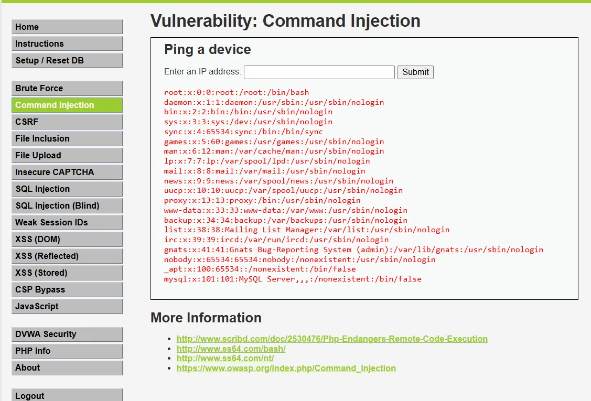

# 04 — Inyección de Comandos

## 1. Evidencia del ataque

**Módulo DVWA:** Command Injection  
**Nivel de seguridad:** Low  
**Payload:** `127.0.0.1; cat /etc/passwd`



> **Resultado:** El servidor ejecuta el comando `cat /etc/passwd` y retorna el contenido
> del archivo de usuarios del sistema operativo Linux.

---

## 2. ¿Por qué funciona?

La aplicación pasa el input del usuario directamente a una función de ejecución de
comandos del SO (como `exec()` o `shell_exec()`). El operador `;` en Unix encadena
comandos, permitiendo que el segundo se ejecute independientemente del primero.

En AguasClaras, el servidor corre Linux. El atacante puede ejecutar comandos con los
privilegios del proceso web para:
- Leer archivos de configuración con credenciales de BD
- Listar todos los usuarios del sistema
- Instalar backdoors o reverse shells
- Exfiltrar la base de datos completa de clientes

```bash
# Comando ejecutado en el servidor
ping -c 1 127.0.0.1; cat /etc/passwd
```

---

## 3. Puntaje CVSS v3.1

**Vector:** `CVSS:3.1/AV:N/AC:L/PR:N/UI:N/S:U/C:H/I:H/A:H`  
**Puntaje base:** **9.8 — CRÍTICO**

| Métrica | Valor | Justificación |
|---|---|---|
| Vector de ataque | Red (N) | Explotable remotamente vía portal web |
| Complejidad | Baja (L) | Sin condiciones especiales |
| Privilegios requeridos | Ninguno (N) | El formulario es accesible sin login |
| Interacción de usuario | Ninguna (N) | El atacante ejecuta sin intervención de la víctima |
| Confidencialidad | Alta (H) | Acceso total al sistema de archivos del servidor |
| Integridad | Alta (H) | Puede modificar o eliminar archivos críticos |
| Disponibilidad | Alta (H) | Puede detener servicios o reiniciar el servidor |

---

## 4. Política de prevención (3.1.4)

AguasClaras debe prohibir el uso de funciones que ejecuten comandos del SO con input
no validado (`exec()`, `system()`, `shell_exec()`). Toda funcionalidad que requiera
interacción con el SO debe encapsularse en módulos internos con inputs estrictamente
tipados y validados mediante whitelist, sin pasar strings de usuario directamente al shell.

---

## 5. Control de mitigación (3.1.5)

| Control | Descripción | Prioridad |
|---|---|---|
| Eliminar uso de shell | Reemplazar comandos del SO por librerías internas del lenguaje | Inmediata |
| Whitelist de input | Validar IPs con regex estricto (`^\d{1,3}\.\d{1,3}\.\d{1,3}\.\d{1,3}$`) antes de usarlas | Inmediata |
| Mínimo privilegio | El proceso web corre con usuario sin privilegios de root | Alta |
| Sandbox / contenedor | Ejecutar la app en Docker con filesystem de solo lectura | Media |
